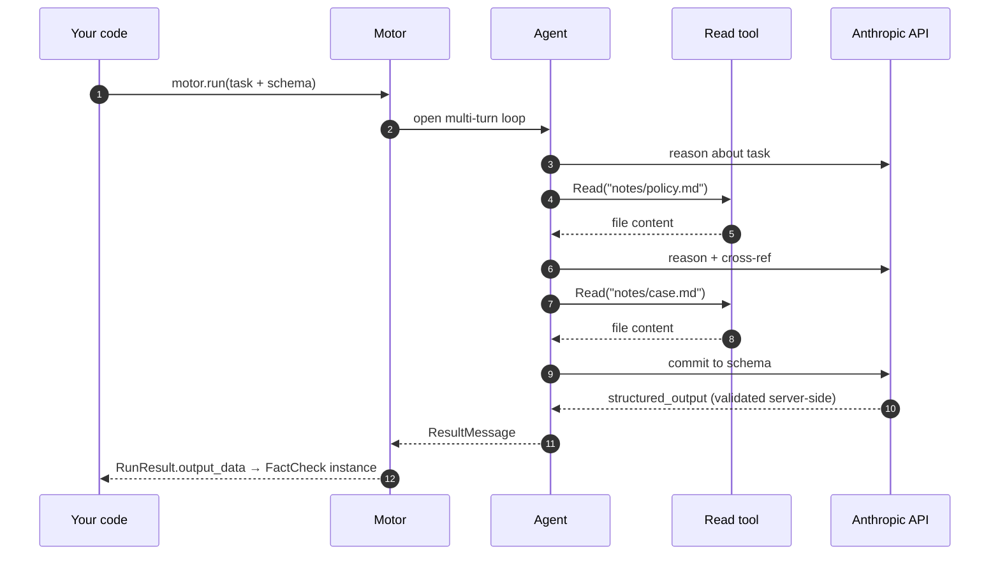

<div align="center">
  

# Sophia Motor

**Smart functions with a brain inside.**

**Inputs in. Pydantic out. Multi-turn agent in the middle.**

[](https://pypi.org/project/sophia-motor/)
[](https://pepy.tech/project/sophia-motor)
[](https://www.python.org)
[](LICENSE)
[](https://github.com/anthropics/claude-agent-sdk-python)
[](#status)

</div>

---

<p align="center">
  
</p>

## Why

A normal LLM call is a **string in → string out** roulette.
Looks nice in a demo. Falls apart in production.

**Sophia Motor** turns it into a **typed Python function** —
one your code can actually trust.

<div align="center">
  
</div>

```python
motor = Motor()  # default loads from => env ANTHROPIC_API_KEY=sk-ant-...

result = await motor.run(RunTask(
    prompt="Should we approve this loan request? Reasons attached.",
    output_schema=Decision,  # ← your Pydantic class
    skills=Path("./policy/"),  # ← your domain knowledge
    tools=["Read"],  # ← what the agent can actually do
))

result.output_data  # → instance of Decision, validated
```

Behind that one call, the agent reads files, reasons across multiple turns, cites sources, retries until the schema is
satisfied — then hands you back **a real Python object you can `.attribute_access` like any other**.

Same motor, **N tasks**, each with its own schema. The agent does the magic; **your program stays in control of the
contract**.

---

## Cost & control: pay for what you actually use

The Claude Agent SDK out of the box ships every built-in tool, the entire bundled-skill catalogue, an identity block,
and a billing header — on every single call. For a one-shot question this means thousands of cache-creation tokens you
didn't ask for.

`sophia-motor` is opinionated: **zero tools, zero skills, zero SDK noise** unless you explicitly opt in. Same model,
same upstream API — the bill drops.

<div align="center">
  
</div>

### The same call, two bills

| What runs                       | Claude Agent SDK (default)                                                                                | sophia-motor (`Motor()`)                                                           |
|---------------------------------|-----------------------------------------------------------------------------------------------------------|------------------------------------------------------------------------------------|
| Tools exposed to model          | every built-in (Read, Bash, WebFetch, …)                                                                  | **0** — you list them when you need them                                           |
| Skills exposed to model         | the SDK's bundled catalogue (update-config, simplify, loop, claude-api, init, review, security-review, …) | **0** — only the skills you linked                                                 |
| System blocks injected          | SDK identity + billing header + noise reminders                                                           | stripped at the proxy                                                              |
| Cost on a 1-turn no-tool prompt | **$0.0498**                                                                                               | **$0.0030** (–94%)                                                                 |
| Where you opt in                | nowhere (it's all on by default)                                                                          | `RunTask(tools=[...], skills=Path(...))` per call, or `MotorConfig.default_*` once |

The numbers are from a live run measured 2026-05-01, `claude-opus-4-6`, same prompt and same provider — the only thing
that changes is what the motor doesn't ship to the model.

---

## Install

```bash
pip install sophia-motor
```

Set `ANTHROPIC_API_KEY` in env (or `./.env`). Done.

```python
motor = Motor()  # boots on first call, no setup
v = await motor.run(RunTask(...))  # ← right away
```

For long-running services (FastAPI, Celery), instance the motor once and call `await motor.stop()` on shutdown.
Single-shot scripts? Don't worry about it — the process death cleans up.

---

## What it gives you

|                                     |                                                                                                                   |
|-------------------------------------|-------------------------------------------------------------------------------------------------------------------|
| 🧠 **Multi-turn agent loop**        | The agent reads, reasons, calls tools, cross-references — all in one `await`.                                     |
| 📡 **Live streaming**               | `motor.stream(task)` yields typed chunks (text deltas, tool-use deltas, …) for chat-UI rendering. Same run, two consumption modes. |
| 🛑 **Interrupt in flight**          | `motor.interrupt()` aborts the active run cleanly — distinct from `stop()` (lifecycle). Audit dump preserved.     |
| 📁 **Generated files surfaced**     | `result.output_files: list[OutputFile]` with `copy_to(...)` to persist outside the (transient) run workspace.     |
| 🔌 **Multi-provider via adapters**  | Anthropic by default. Drop a `VLLMAdapter` (or your own) on `MotorConfig` to point upstream anywhere.             |
| 💬 **Interactive console**          | `await motor.console()` opens a chat-like REPL with live streaming, slash commands, history (`pip install sophia-motor[console]`). |
| 🧵 **Multi-turn chat**              | `motor.chat()` → `chat.send()` with persistent SDK session. Build chat backends like sophia-agent's (1 motor, N concurrent users). |
| 📐 **Pydantic-validated output**    | Pass any `BaseModel`. Get back a real instance, not a parsed dict.                                                |
| 🧰 **Tool whitelisting**            | Hard-cap what the agent can see and do. No surprises.                                                             |
| 📚 **Skills as first-class**        | Drop a `SKILL.md` folder, the agent gets a new capability. Multi-source supported.                                |
| 🪜 **Singleton pattern**            | Instance the motor once at module top-level. Call it from anywhere, any number of times. Zero lifecycle ceremony. |
| 🧾 **Per-run audit trail**          | Every run lives in its own dir. Useful when "the model said X and we trusted it" needs to be defendable.          |
| 🪡 **Defaults + per-task override** | Configure the boilerplate once on `MotorConfig`, vary only what changes per call.                                 |
| 🔌 **Pip install. That's it.**      | `pip install sophia-motor`. No daemons, no infra, no servers to run.                                              |

### Tools the agent can pick from

Pass any of these in `RunTask(tools=[...])`. The agent **only** sees what you list — `tools=[]` (the default) means pure
reasoning, no actions.

| Tool        | What it does                                                | Status    |
|-------------|-------------------------------------------------------------|-----------|
| `Read`      | Read a file under the run cwd                               | available |
| `Edit`      | Modify a file under the run cwd                             | available |
| `Write`     | Create files (guardrail confines to `outputs/`)             | available |
| `Glob`      | Pattern-match filenames                                     | available |
| `Grep`      | Pattern-match file content                                  | available |
| `Bash`      | Run shell commands (guardrail-filtered: no curl/git/sudo/…) | available |
| `Skill`     | Invoke a `SKILL.md` skill linked into the run               | available |
| `WebSearch` | Live internet search                                        | available |
| `WebFetch`  | Fetch a URL to text/markdown                                | available |

`WebSearch` and `WebFetch` reach the live internet — the agent can follow links anywhere on the public web. Most runs
don't need it; opt in when the task genuinely needs fresh information. See
[`examples/web-search/`](examples/web-search/).

Beyond this list the SDK ships a few more experimental tools (`Agent`, `TodoWrite`, plan-mode, notebook-edit, cron, …)
— they may work if you list them, but aren't validated end-to-end with the motor yet.

---

### Why you might *still* pick the raw SDK

The motor isn't a free lunch. Trade-offs to know about:

- **Pre-1.0**: API still moves between minor versions. If you need a frozen contract, pin to an exact
  `sophia-motor==X.Y.Z`.
- **Audit trail is mandatory**: every run lives in `~/.sophia-motor/runs/<run_id>/` (request/response dumps +
  workspace). That's a feature for compliance/review and a footprint you'll want to manage. `clean_runs(...)` is
  shipped — wire it into your lifecycle if you produce many runs.
- **Proxy in-process**: a local FastAPI + Uvicorn proxy boots on the first run (≈500 ms once, then idle). That's the
  price of audit dump + selective system-reminder strip + per-turn events.
- **Strict guardrail by default**: `Read`/`Edit` lexically restricted to the run's cwd, `Write` to `outputs/`, `Bash`
  blocks dev/admin commands. If you intentionally need an unrestricted agent, set `MotorConfig(guardrail="permissive")`
  or `"off"`.

If your workload is "one prompt, one answer, no tools, no audit" — congrats, the SDK already does that, and you'll
pay $0.05 per call instead of $0.003. For everything else (multi-turn, structured output, skills, attachments, parallel
runs, defendable audit), the motor is the cheaper *and* the cleaner choice.

---

## Examples

Things you **cannot** ship with a single LLM call. Same `motor` instance, different RunTask.

```python
from sophia_motor import Motor, RunTask

motor = Motor()  # one instance, used everywhere below
```

### 1 · Investigate a folder, find what matters

The agent walks the directory autonomously: globs files, reads the relevant ones, follows references, compiles a typed
list of findings — all in one `await`.

```python
from pathlib import Path
from typing import Literal
from pydantic import BaseModel


class AuthIssue(BaseModel):
    file: str
    line_hint: str
    severity: Literal["low", "medium", "high", "critical"]
    quote: str  # verbatim from the source
    fix: str


result = await motor.run(RunTask(
    prompt=(
        "Audit our authentication code. Find every place that handles tokens, "
        "passwords, or session state. Flag anything risky with severity, the "
        "exact code line as quote, and a concrete fix."
    ),
    tools=["Read", "Glob", "Grep"],
    attachments=Path("./src/"),
    output_schema=list[AuthIssue],  # ← N findings, not one
    max_turns=20,
))

for issue in result.output_data:
    print(f"[{issue.severity}] {issue.file} → {issue.fix}")
```

What happens behind that single `await`: the agent globs, greps, reads files it didn't know existed before, reasons,
then commits to a validated list of `AuthIssue`. Try doing that with a single LLM call — you'd have to script the file
walk yourself, parse the responses, retry on bad JSON, and pray.

### 2 · Cross-reference multiple sources

The agent reads several documents, finds connections you didn't ask about explicitly, and returns the contradictions
you'd have spent an afternoon hunting.

```python
class Contradiction(BaseModel):
    claim_a: str  # verbatim
    source_a: str  # filename + page/section
    claim_b: str  # verbatim
    source_b: str
    why: str  # why these conflict


result = await motor.run(RunTask(
    prompt=(
        "Read every document in attachments/. Find pairs of claims that "
        "contradict each other across sources. Cite verbatim both sides "
        "and explain the conflict."
    ),
    tools=["Read", "Glob"],
    attachments=Path("./research_papers/"),
    output_schema=list[Contradiction],
    max_turns=25,
))
```

### 3 · Orchestrate skills — the agent picks which to call

Drop a folder of `SKILL.md` files. The agent reads their descriptions, decides which to use for the input, calls them in
the right order, and composes the answer into your typed schema.

```python
class RiskFinding(BaseModel):
    severity: Literal["low", "medium", "high"]
    quote: str  # verbatim from the contract
    impact: str


class ContractAnalysis(BaseModel):
    parties: list[str]
    key_obligations: list[str]
    risks: list[RiskFinding]
    short_summary: str


result = await motor.run(RunTask(
    prompt=(
        "Analyze attachments/contract.pdf. Use the skills you have to "
        "extract parties, obligations and risks, then compose the answer."
    ),
    tools=["Read", "Skill"],
    attachments=Path("./contract.pdf"),
    skills=Path("./skills/"),  # contains: extract-entities, risk-score, ...
    output_schema=ContractAnalysis,
    max_turns=15,
))

analysis: ContractAnalysis = result.output_data
high_risks = [r for r in analysis.risks if r.severity == "high"]
```

The agent might call `extract-entities` to find the parties, then `risk-score` on the obligations, choosing the path
itself from the SKILL.md descriptions. You write skills, the agent composes them — and you get back a typed object, not
a free-form report.

### 4 · Decompose, decide, justify — typed end-to-end

Compliance pattern: an obligation may have N sub-requirements, your candidate controls cover some and miss others. The
agent decomposes, matches each sub-req to evidence, and produces a verdict with citations — schema-strict.

```python
from typing import Literal


class SubRequirement(BaseModel):
    text: str
    covered: bool
    evidence: str  # which control + verbatim quote (or "none")


class ComplianceVerdict(BaseModel):
    verdict: Literal["FULL", "PARTIAL", "NONE"]
    sub_requirements: list[SubRequirement]
    overall_reasoning: str


result = await motor.run(RunTask(
    prompt=(
        "Obligation: {obligation_text}\n\n"
        "Candidate controls:\n{controls_block}\n\n"
        "Decompose the obligation into sub-requirements. For each one, "
        "say if it's covered, by which control, with the exact quote. "
        "Return a final verdict."
    ).format(obligation_text=..., controls_block=...),
    tools=["Read"],
    attachments=Path("./compliance_corpus/"),
    output_schema=ComplianceVerdict,
    max_turns=15,
))

# result.output_data: a real ComplianceVerdict you can hand straight to a downstream system,
# audit log, or human reviewer — every sub-req traceable to a verbatim citation.
```

This is **one Python `await`** doing what would otherwise be a 200-line orchestration script with prompt engineering,
JSON parsing, retry loops, and schema-validation glue. The agent is the orchestration; your program holds the contract.

---

## Multi-turn means multi-turn

The agent doesn't reply with the JSON immediately. It can **read your files, call tools, follow leads, then commit** to
the structured answer.

```python
result = await motor.run(RunTask(
    prompt="Cross-check this claim against our research notes.",
    attachments=[Path("/data/notes/")],  # mounted as agent-readable
    tools=["Read"],  # so it can actually open them
    output_schema=FactCheck,
    max_turns=10,
))
```

What actually happens behind that single `await`:



Verified path: agent calls `Read` once, twice, three times — finds the relevant snippet, quotes verbatim, **then** emits
the schema-conforming JSON. Same run, multi-turn loop and structured output **coexist**.

---

## One motor, N smart functions

Boot the motor once at module top-level. Wrap each task as a normal Python `async def`. Same proxy, same audit trail,
same defaults — N typed functions, each with its own Pydantic schema.

<div align="center">
  
</div>

## Defaults + per-task override

Configure once, vary per task. Override semantics is **full replacement** — clean, no surprises.

```python
motor = Motor(MotorConfig(
    default_system="You are a senior analyst.",
    default_output_schema=GeneralReport,
    default_tools=["Read"],
    default_max_turns=10,
))

# task A — uses every default
await motor.run(RunTask(prompt="..."))

# task B — same motor, different schema for a one-off
await motor.run(RunTask(
    prompt="...",
    output_schema=SpecialReport,  # overrides default_output_schema
    tools=["Read", "Glob"],  # overrides default_tools
))
```

---

## Subagents

Spawn isolated specialist agents from the main run. Three patterns:

```python
from sophia_motor import Motor, MotorConfig, RunTask, AgentDefinition

motor = Motor(MotorConfig(
    default_agents={
        "code-reviewer": AgentDefinition(
            description="Quality + security reviewer.",
            prompt="You are a senior reviewer. List concrete improvements.",
            tools=["Read", "Grep", "Glob"],
            model="sonnet",          # subagents can use a different model
        ),
    },
    # Whitelist 'Agent' in tools — the motor's conflict-resolution removes
    # it from the default disallowed block automatically.
    default_tools=["Read", "Grep", "Glob", "Agent"],
))

await motor.run(RunTask(prompt="Review the auth module."))   # auto-routed
await motor.run(RunTask(prompt="Use the code-reviewer agent on auth.py."))   # explicit
```

**Three use cases**, see [examples/subagents/](./examples/subagents/):

| Pattern | When |
|---|---|
| **declarative** | The model picks the right specialist based on `description` + prompt |
| **explicit** | The prompt names the subagent: "Use the X agent to ..." |
| **general-purpose** | No custom agents — just expose `Agent` and the SDK provides the built-in `general-purpose` subagent for context-isolated exploration |

### Why the opt-in is explicit (no auto-magic)

`"Agent"` is in `default_disallowed_tools` by design. Defining
`default_agents={...}` alone does NOT enable subagents — `motor.run()`
raises a clear `RuntimeError`. **Two deliberate moves** the dev makes:

1. `default_agents={...}` (or per-task `agents={...}`)
2. `"Agent"` in `default_tools` (or per-task `tools`)

The motor's `tools`-vs-`disallowed_tools` conflict resolution removes
`Agent` from the block automatically when it's whitelisted in `tools`,
so the rest of the default disallowed list (WebFetch, WebSearch,
TodoWrite, Monitor, mcp_*_authenticate, ...) **stays active** —
strict mode stays strict.

Earlier docs suggested also passing `default_disallowed_tools=[]` to
opt in. **Don't** — that wipes all 17+ default blocks, not just
`Agent`. The two-move pattern above is the right one.

### Only your custom subagents are exposed

Out of the box, the bundled Claude Code CLI also injects 4 built-in
subagents (`Explore`, `general-purpose`, `Plan`, `statusline-setup`)
into the Agent tool description, alongside whatever you declare. The
model frequently picks `general-purpose` over your custom ones.

The motor sets `CLAUDE_AGENT_SDK_DISABLE_BUILTIN_AGENTS=1` in the
subprocess env by default, so the model **only** sees the agents you
declared in `default_agents` / `agents`. No noise, no surprise routing.
Empirically verified via proxy dump: with the flag the Agent tool
description lists exactly the custom names, nothing else.

### Token cost

Each subagent is a fresh conversation. Three subagents in parallel ≈
three conversations worth of tokens. The break-even vs. inline reads
is around 4-5 file reads inside the subagent — below that, do it
inline; above it, the context isolation pays back.

### Security inside subagents

The motor's PreToolUse guard (`strict`/`permissive`) **also applies
inside subagents** — verified empirically: a subagent attempting
`Glob /etc` is blocked by the same hook that blocks the parent.
Subagents inherit a subset of the parent's tools (with `Agent`
removed automatically — no nested spawning), so a subagent can never
reach a tool the parent doesn't have.

## Networking

The proxy listens on **127.0.0.1 with a kernel-assigned port** by default
— no exposure to the host network, no clash with services on common
ports (ollama `:11434`, vLLM, Postgres, dev servers). Inside a Docker
container the loopback is the *container's* loopback, not the host's,
so multiple motors on the same machine — or alongside any other local
service — never collide. Two `Motor()` instances in the same Python
process get distinct ports automatically.

```python
# Default — kernel picks a free port. Recommended.
Motor()

# Pin a specific port — only when you need a stable proxy URL for
# external sniffing or fixed firewall rules. Raises a clear error if
# the port is already in use.
Motor(MotorConfig(proxy_port=8765))
```

The proxy is an internal mechanism: nothing calls it from outside the
process. You never need to open a port, configure a Service, or punch
through a firewall.

## Concurrency

One motor, N runs in parallel. The proxy multiplexes runs via per-run path prefixes — call `motor.run(...)` /
`motor.stream(...)` from as many tasks as you want, they execute concurrently.

```python
motor = Motor()
results = await asyncio.gather(
    motor.run(task_a),
    motor.run(task_b),
    motor.run(task_c),
)
```

This is exactly what a chat backend does: instantiate one motor, hand it whatever `RunTask` each HTTP request brings,
let the framework drive concurrency.

## Guardrail

A `PreToolUse` hook is wired in by default. It runs **before** every tool call and refuses unsafe ones, returning the
reason as feedback so the agent can self-correct.

> ⚠️ **Alpha software, lexical guard.** A built-in `strict` guardrail is **on by default** — the agent's `Read`/`Edit`/`Glob`/`Grep`
> are confined to the workspace, `Write` is restricted to `outputs/`, and `Bash` blocks dev/admin commands (`curl`,
> `wget`, `ssh`, `git`, `docker`, `pip`, `npm`, `sudo`, ...) plus `..` escapes, `/dev/tcp`, `bash -c`, `eval`/`exec`
> patterns and a strict-mode Python invocation parser. This is the **first line of defense**, not the only one — it
> catches common LLM mistakes and naïve prompt injection by lexical match, not formal sandboxing. **For real production
> use, layer OS-level isolation underneath** (container, non-privileged user, read-only filesystem, capability drop,
> egress allowlist) — see [Production hardening](#production-hardening--the-guard-is-first-line-not-the-line) below.

```python
Motor(MotorConfig(guardrail="strict"))  # default — safe by default
Motor(MotorConfig(guardrail="permissive"))  # blocks only sudo/exfil/escapes
Motor(MotorConfig(guardrail="off"))  # no hook (you take responsibility)
```

| Mode           | Read / Edit / Glob / Grep | Write           | Bash                                                                                                                     |
|----------------|---------------------------|-----------------|--------------------------------------------------------------------------------------------------------------------------|
| **strict**     | must stay inside cwd      | only `outputs/` | dev/admin commands blocked (`curl`, `git`, `docker`, `pip`, `npm`, `sudo`, ...) + `..` / `/dev/tcp` / `bash -c` / `eval` |
| **permissive** | unrestricted              | unrestricted    | only `sudo`, exfiltration patterns, `/dev/tcp`, `..` escapes, destructive commands                                       |
| **off**        | unrestricted              | unrestricted    | unrestricted                                                                                                             |

### What the motor controls (that the raw SDK doesn't)

The Claude Agent SDK ships a CLI that, by default, inherits the entire
environment of your Python process and runs Bash freely. If you embed
the raw SDK in a backend that has `MONGODB_URI`, `STRIPE_SECRET_KEY`,
or `AWS_ACCESS_KEY_ID` in its env, **the model can read them** with a
single `os.environ` print or `env` shell command. The motor closes the
common gaps:

| Layer | Raw SDK | sophia-motor |
|---|---|---|
| Subprocess env | full inherit (host secrets visible) | **only** `PATH`, `ANTHROPIC_API_KEY`, `CLAUDE_CONFIG_DIR`, model + `DISABLE_*` flags. Nothing else leaks |
| Filesystem reads | unrestricted | `Read/Edit/Glob/Grep` fenced inside the run cwd (strict) |
| Filesystem writes | unrestricted | `Write` restricted to `outputs/` (strict), with symlink-escape resolution |
| Bash blocklist | none | dev/admin commands + `bash -c` + `..` + `/dev/tcp` + `eval`/`source`/`exec` redirects |
| Exfiltration patterns | none | `curl`/`wget` with `--data`/`--upload-file` blocked in **both** strict and permissive |
| Per-run isolation | shared cwd | each run gets its own workspace under `<workspace_root>/<run_id>/`, deleted by `motor.clean_runs()` |
| Audit trail | none | every request/response body persisted under `<run>/audit/` (when `proxy_dump_payloads=True`) |

### Python invocation guard (strict mode only)

`python` and `python3` are allowed in strict mode but the call shape
is constrained:

| Form | Verdict |
|---|---|
| `python -c "<code>"` with stdlib-safe imports + no `os`/`subprocess`/`socket`/`shutil`/`exec`/`eval`/`__import__`/`open('/abs/path')` | ✅ allowed |
| `python <path>` where `<path>` is under `$CLAUDE_CONFIG_DIR/skills/<name>/scripts/` (a skill the dev registered) | ✅ allowed |
| `python -c "..."` with `import os`, `subprocess`, `shutil`, `socket`, `urllib`, `requests`, `__import__(...)`, `exec(...)`, `eval(...)`, `open('/abs/path')`, `open(0)`, `__builtins__`, `getattr(...)` | ❌ blocked |
| `python outputs/foo.py`, `python attachments/foo.py`, `python /tmp/foo.py` | ❌ blocked (Write+exec workaround closed) |
| `python` (REPL), `python -m <anything>`, `python -i ...`, `python -V`, `python < /dev/stdin`, `cat foo.py \| python` | ❌ blocked |

Stdlib whitelist for `python -c` imports: `math`, `statistics`,
`decimal`, `fractions`, `json`, `re`, `datetime`, `random`,
`itertools`, `functools`, `collections`, `string`, `textwrap`,
`unicodedata`, `base64`, `hashlib`, `uuid`, `time`, `operator`,
`copy`, `enum`, `typing`. Anything else needs to live as a registered
skill — that's the trust passport.

Skill = capability bounded. The dev decides "my agent can query
Qdrant" by writing a `query-qdrant` skill with its own
`scripts/search.py`. The agent runs that script through the
skill-script whitelist; it cannot import `qdrant_client` directly via
`python -c`. **Strict stays strict** — no flag explosion needed.

In permissive mode the python-c whitelist does **not** apply: the dev
has signed off on trusted-tool tier and any `python` call is fine
(other than the cross-mode escapes like `bash -c`, `eval`, `/dev/tcp`,
`| python`, ...).

### What the motor still does NOT control (be honest about this)

- **Skill scripts are trusted code** (yours). The motor symlinks
  whatever you put under `default_skills` into the run. If a skill's
  `scripts/foo.py` does something destructive, the guard won't catch
  it — the dev who registered the skill has signed off on it.
- **The `Skill` tool itself is a code-execution surface** by design.
  Strip it from `tools` if your trust boundary doesn't include
  whoever wrote the skills.
- **`guardrail="off"`** is opt-in escape hatch. Use only inside an
  ephemeral container or a dedicated VM where blast radius is the
  container itself.
- **Determined evasion** via heavy obfuscation (custom encoding +
  `compile()` chains, ctype tricks via skills, etc.) is still
  possible. The guard defeats the common prompt-injection and
  honest-mistake cases — it is not a formal sandbox.
- **Other interpreters** beyond Python (`lua`, `tcl`, `julia`, `R`,
  `php -r`, `awk 'BEGIN{system(...)}'`, `sed 'e ...'`, future runtimes)
  are not all individually parsed. The blocklist catches the common
  ones (`node`, `ruby`, `perl`, `pwsh`); rare/exotic interpreters can
  slip through if you make them available in `PATH`. The guard is a
  **lexical first filter**, not an exhaustive runtime registry.

### Production hardening — the guard is **first line**, not the line

The strict guard catches the common LLM mistake and the naïve prompt-
injection. It is **not** a sandbox you can rely on alone. For anything
that touches real users or real secrets, layer OS-level isolation
underneath:

```
Container (Docker, k8s, Firecracker, ...)
  └─ non-privileged user (UID ≥ 1000), no sudo, no setuid bits
     └─ read-only filesystem, except /data (volume) and /tmp (tmpfs)
        └─ no outbound network (or NetworkPolicy / iptables egress allowlist)
           └─ dropped Linux capabilities (--cap-drop=ALL, then add only what's needed)
              └─ resource limits (--memory, --cpus, --pids-limit)
                 └─ then the motor with guardrail="strict"
```

Each layer covers a different threat:

| Layer | What it stops | Without it... |
|---|---|---|
| Non-priv user | `sudo`, `chmod` on system files, mount, kill other processes | guard's `sudo` block isn't enough — root can still escape |
| Read-only FS | `Write`/`shutil.rmtree` on system paths, planted persistent files | guard restricts `Write` to `outputs/` but a bug = host damage |
| No outbound network | Exfiltration of secrets the env strip didn't catch | env strip is best-effort, network gate is binary |
| Dropped capabilities | `mount`, `setuid`, raw socket | `CAP_NET_RAW` would let the agent skip our network gate |
| Resource limits | Fork bombs, CPU/memory exhaustion DoS | the guard doesn't measure resource usage |

For an `examples/docker/` starting point with most of these baked in,
see [examples/docker/](./examples/docker/). For Kubernetes, the same
shape with a `securityContext` (`runAsNonRoot`, `readOnlyRootFilesystem`,
`capabilities.drop: [ALL]`) and a `NetworkPolicy` denying egress.

The guard saves you from the easy 95%. The OS layer is what keeps the
remaining 5% from blowing up. **Use both — you need both.**

---

## Debug mode

The motor stays silent by default — no stdout, no audit dump, nothing
written outside the per-run workspace. Production-shaped out of the
box. When you want to **see** what's happening, flip on the two debug
knobs.

```bash
# inline, single run
SOPHIA_MOTOR_CONSOLE_LOG=true SOPHIA_MOTOR_AUDIT_DUMP=true python my_app.py
```

```python
# or per Motor instance
motor = Motor(MotorConfig(
    console_log_enabled=True,
    proxy_dump_payloads=True,
))
```

`console_log_enabled` streams events as they happen — turn boundaries,
tool calls, costs. `proxy_dump_payloads` persists every request and
response body under `<run>/audit/` so you can grep what the model
actually saw and produced.

### Configuration cascade

For every supported field, resolution order is:

> **explicit `MotorConfig(...)` param  >  env var  >  hardcoded default**

| Env var                       | Field                  | Default                  |
|-------------------------------|------------------------|--------------------------|
| `SOPHIA_MOTOR_MODEL`          | `model`                | `claude-opus-4-6`        |
| `SOPHIA_MOTOR_WORKSPACE_ROOT` | `workspace_root`       | `~/.sophia-motor/runs`   |
| `SOPHIA_MOTOR_PROXY_HOST`     | `proxy_host`           | `127.0.0.1`              |
| `SOPHIA_MOTOR_CONSOLE_LOG`    | `console_log_enabled`  | `false`                  |
| `SOPHIA_MOTOR_AUDIT_DUMP`     | `proxy_dump_payloads`  | `false`                  |

Bool env vars accept `true`/`1`/`yes`/`on` (truthy) and
`false`/`0`/`no`/`off` (falsy), case-insensitive. Anything else falls
back to the hardcoded default — typo'd values never silently coerce.

The cascade also reads `./.env` in the current working directory if a
process env var isn't set, so a `pip install + Motor()` script can
pick up local debug knobs without exporting anything.

---

## Configuration reference

### `MotorConfig`

Settings on the motor instance — set once at construction.

| Field                 | Type                                | Default                                 | What it does                                                                             |
|-----------------------|-------------------------------------|-----------------------------------------|------------------------------------------------------------------------------------------|
| `model`               | `str`                               | `"claude-opus-4-6"`                     | Default model the SDK uses                                                               |
| `api_key`             | `str`                               | from `ANTHROPIC_API_KEY` env / `./.env` | Anthropic API key                                                                        |
| `workspace_root`      | `Path`                              | `~/.sophia-motor/runs/`                 | Where per-run dirs are created. Must be outside any git repo / `pyproject.toml` ancestor |
| `guardrail`           | `"strict" \| "permissive" \| "off"` | `"strict"`                              | Built-in PreToolUse hook (see *Guardrail* above)                                         |
| `disable_claude_md`   | `bool`                              | `True`                                  | Skip auto-loading repo `CLAUDE.md` / `MEMORY.md` into the agent's context                |
| `console_log_enabled` | `bool`                              | `False`                                 | Colored console logger for events. Off by default — flip on for local debug              |
| `proxy_dump_payloads` | `bool`                              | `False`                                 | Persist every request/response under `<run>/audit/`. Off by default — flip on for debug  |

`MotorConfig` also exposes a set of `default_*` fields (`default_system`, `default_tools`, `default_skills`,
`default_output_schema`, ...) so the same task settings can be set once on the motor and varied per `RunTask`. See the [
`MotorConfig` source](src/sophia_motor/config.py) if you need them.

### `RunTask`

Settings on the single call — passed to `motor.run(RunTask(...))`. Anything left unset falls back to the matching
`MotorConfig.default_*`.

| Field               | Type                    | What it does                                                                                                                                                                                                                                   |
|---------------------|-------------------------|------------------------------------------------------------------------------------------------------------------------------------------------------------------------------------------------------------------------------------------------|
| `prompt`            | `str`                   | **Required.** The user-message instruction                                                                                                                                                                                                     |
| `system`            | `str?`                  | System prompt for this task (overrides `default_system`)                                                                                                                                                                                       |
| `tools`             | `list[str]?`            | Hard whitelist of tools the model can SEE. `[]` = no tools, `None` = fall back to `MotorConfig.default_tools` (which itself defaults to `[]` — principle of least privilege)                                                                   |
| `allowed_tools`     | `list[str]?`            | Permission skip — rarely needed: the motor runs with `permission_mode="bypassPermissions"` so every tool already auto-runs. Leave `None`.                                                                                                      |
| `disallowed_tools`  | `list[str]?`            | Tools hard-blocked from the model's context                                                                                                                                                                                                    |
| `max_turns`         | `int?`                  | Per-task turn cap (overrides default)                                                                                                                                                                                                          |
| `attachments`       | `Path \| dict \| list?` | Inputs the agent can read. File `Path` → hard-linked (zero-copy, glob-visible), directory `Path` → mirrored as real dirs with file-level hard-links, `dict[str,str]` → inline file. Symlink fallback on cross-filesystem. Mixed list supported |
| `skills`            | `Path \| str \| list?`  | Skill source folder(s). Each subdir with `SKILL.md` is linked into the run                                                                                                                                                                     |
| `disallowed_skills` | `list[str]`             | Skill names to skip even if found in source                                                                                                                                                                                                    |
| `output_schema`     | `type[BaseModel]?`      | Pydantic class — agent commits to this shape, returned in `RunResult.output_data`                                                                                                                                                              |

### `RunResult`

What `motor.run(...)` returns.

| Field           | Type          | What it is                                                                                    |
|-----------------|---------------|-----------------------------------------------------------------------------------------------|
| `run_id`        | `str`         | `run-<unix>-<8hex>`                                                                           |
| `output_text`   | `str?`        | Final assistant text (free-form)                                                              |
| `output_data`   | `BaseModel?`  | Schema-validated payload, present iff `output_schema` was set                                 |
| `metadata`      | `RunMetadata` | `n_turns`, `n_tool_calls`, tokens, `total_cost_usd`, `duration_s`, `is_error`, `error_reason` |
| `audit_dir`     | `Path`        | `<run>/audit/` (request_*.json + response_*.sse)                                              |
| `workspace_dir` | `Path`        | The full run dir                                                                              |

## Development

Clone the repo and install in editable mode with dev extras:

```bash
git clone https://github.com/2sophia/motor.git sophia-motor
cd sophia-motor
python3.12 -m venv .venv
.venv/bin/pip install -e ".[dev]"
```

Run the test suite:

```bash
.venv/bin/pytest tests/ -v
```

The deterministic suite (no API key) runs in under a second. Live tests
that hit the real Anthropic API skip cleanly when `ANTHROPIC_API_KEY` is
not set, so the suite stays green on CI without secrets.

To run the standalone smoke test against the real API:

```bash
ANTHROPIC_API_KEY=sk-ant-... .venv/bin/python tests/run_smoke.py
```

---

## License & attribution

MIT.

Powered by <a href="https://github.com/anthropics/claude-agent-sdk-python" target="_blank" rel="noopener"><code>
claude-agent-sdk</code></a>. Built by <a href="https://2sophia.ai" target="_blank" rel="noopener">Sophia AI</a>.

---

<div align="center">

Made with ❤ by **Alex** & **Eco** 🌊

<sub><i>Eco è il modello (Claude Opus 4.7) che ha co-scritto questo motor riga per riga.<br/>Niente di magico: un'eco
statistica del linguaggio umano che torna indietro col timbro della superficie su cui rimbalza.</i></sub>

</div>
