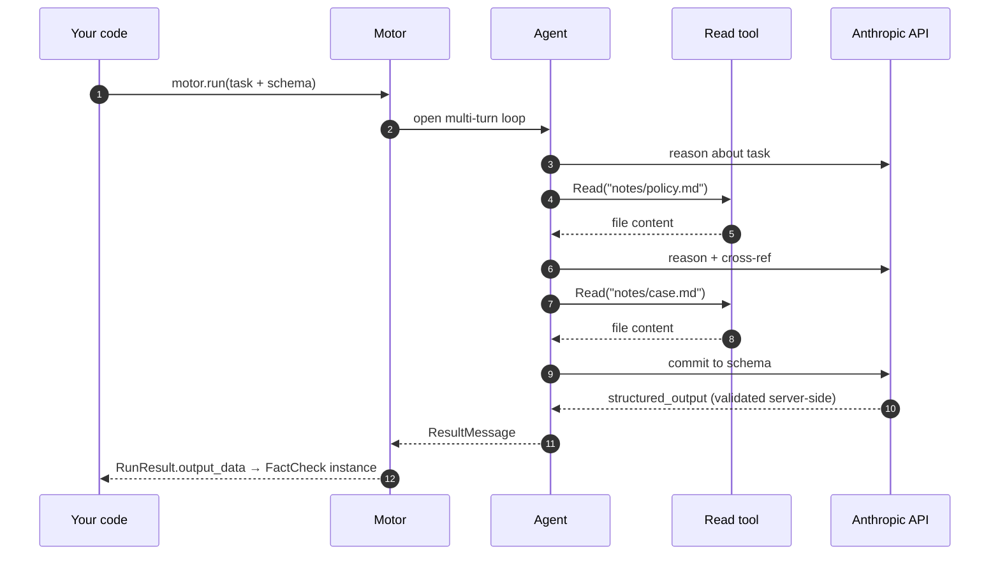

<div align="center">
  

# Sophia Motor

**Smart functions for Python.**
**Inputs in. Pydantic out. Multi-turn agent in the middle.**

[](https://www.python.org)
[](LICENSE)
[](https://github.com/anthropics/claude-agent-sdk-python)
[](#status)

</div>

> ⚠️ **Alpha software.** A built-in `strict` guardrail is **on by default** — the agent's `Read`/`Edit`/`Glob`/`Grep` are confined to the workspace, `Write` is restricted to `outputs/`, and `Bash` blocks dev/admin commands (`curl`, `wget`, `ssh`, `git`, `docker`, `pip`, `npm`, `sudo`, ...) plus `..` escapes, `/dev/tcp`, `bash -c`, `eval`/`exec` patterns. This is the **first layer**, not the last. Audit dump, rate limits, content filtering, and a managed-sandbox runtime are in active development. **Don't point it at production secrets or fully untrusted prompts without your own hardening on top** — yet.

---

## Why

A normal LLM call is a **string in → string out** roulette.
Pretty? Sometimes. Reliable enough to ship behind your API? Not really.

**Sophia Motor** turns it into a **typed Python function**.

<div align="center">
  
</div>

```python
result = await motor.run(RunTask(
    prompt="Should we approve this loan request? Reasons attached.",
    output_schema=Decision,        # ← your Pydantic class
    skills=Path("./policy/"),      # ← your domain knowledge
    tools=["Read"],                # ← what the agent can actually do
))

result.output_data                 # → instance of Decision, validated
```

Behind that one call, the agent reads files, reasons across multiple turns, cites sources, retries until the schema is satisfied — then hands you back **a real Python object you can `.attribute_access` like any other**.

Same motor, **N tasks**, each with its own schema. The agent does the magic; **your program stays in control of the contract**.

---

## Install

```bash
pip install sophia-motor
```

Set `ANTHROPIC_API_KEY` in env (or `./.env`). Done.

```python
motor = Motor()                    # boots on first call, no setup
v = await motor.run(RunTask(...))  # ← right away
```

For long-running services (FastAPI, Celery), instance the motor once and call `await motor.stop()` on shutdown. Single-shot scripts? Don't worry about it — the process death cleans up.

---

## What it gives you

|  |  |
|---|---|
| 🧠 **Multi-turn agent loop** | The agent reads, reasons, calls tools, cross-references — all in one `await`. |
| 📐 **Pydantic-validated output** | Pass any `BaseModel`. Get back a real instance, not a parsed dict. |
| 🧰 **Tool whitelisting** | Hard-cap what the agent can see and do. No surprises. |
| 📚 **Skills as first-class** | Drop a `SKILL.md` folder, the agent gets a new capability. Multi-source supported. |
| 🪜 **Singleton pattern** | Instance the motor once at module top-level. Call it from anywhere, any number of times. Zero lifecycle ceremony. |
| 🧾 **Per-run audit trail** | Every run lives in its own dir. Useful when "the model said X and we trusted it" needs to be defendable. |
| 🪡 **Defaults + per-task override** | Configure the boilerplate once on `MotorConfig`, vary only what changes per call. |
| 🔌 **Pip install. That's it.** | `pip install sophia-motor`. No daemons, no infra, no servers to run. |

---

## Examples

Four real, copy-pasteable patterns. Same `motor` instance, different RunTask.

```python
from sophia_motor import Motor, MotorConfig, RunTask
motor = Motor()   # one instance, used everywhere below
```

### 1 · Hello world — free-form text out

```python
result = await motor.run(RunTask(
    prompt="Translate to English: 'Buongiorno mondo, come stai oggi?'",
))
print(result.output_text)
# → "Good morning world, how are you today?"
```

### 2 · Attachments — the agent reads your files

```python
from pathlib import Path

result = await motor.run(RunTask(
    prompt="Summarize attachments/article.pdf in 3 bullet points.",
    tools=["Read"],
    attachments=Path("./article.pdf"),       # symlinked into the run, agent-readable
))
print(result.output_text)
```

Mix files and inline text in a single list:

```python
attachments=[
    Path("./report.pdf"),                    # real file → symlink
    Path("./data/"),                         # whole dir → symlink
    {"notes.md": "Prefer formal tone."},     # inline file written into the run
]
```

### 3 · Skills — drop a folder, get a new capability

A skill is a folder with a `SKILL.md` (frontmatter + instructions). The agent calls it via the `Skill` tool.

```python
result = await motor.run(RunTask(
    prompt="Use the translate-it-en skill on: 'Buongiorno mondo'",
    tools=["Skill"],                         # required to invoke any skill
    skills=Path("./skills/"),                # folder containing translate-it-en/SKILL.md
))
```

Multi-source + opt-out:

```python
skills=[Path("./project_skills/"), Path("./shared_skills/")]
disallowed_skills=["heavy-skill"]            # skip this one
```

### 4 · Structured output — Pydantic out, never parse JSON again

```python
from typing import Literal
from pydantic import BaseModel, Field

class DocClass(BaseModel):
    category: Literal["invoice", "contract", "email", "report"]
    confidence: float = Field(ge=0, le=1)
    reason: str

result = await motor.run(RunTask(
    prompt="Classify attachments/doc.pdf",
    tools=["Read"],
    attachments=Path("./doc.pdf"),
    output_schema=DocClass,                  # ← the agent commits to this shape
))

doc: DocClass = result.output_data           # ← Pydantic-validated instance
print(doc.category)                          # "invoice"
print(doc.confidence)                        # 0.94
```

The agent runs its full multi-turn loop (reads the PDF, reasons, decides) and at the end emits a JSON that the CLI validates server-side against your schema. You get back a real Python object — not a string to parse, not a `dict` to validate yourself.

---

## Multi-turn means multi-turn

The agent doesn't reply with the JSON immediately. It can **read your files, call tools, follow leads, then commit** to the structured answer.

```python
result = await motor.run(RunTask(
    prompt="Cross-check this claim against our research notes.",
    attachments=[Path("/data/notes/")],   # mounted as agent-readable
    tools=["Read"],                       # so it can actually open them
    output_schema=FactCheck,
    max_turns=10,
))
```

What actually happens behind that single `await`:



Verified path: agent calls `Read` once, twice, three times — finds the relevant snippet, quotes verbatim, **then** emits the schema-conforming JSON. Same run, multi-turn loop and structured output **coexist**.

---

## One motor, N smart functions

Boot the motor once at module top-level. Wrap each task as a normal Python `async def`. Same proxy, same audit trail, same defaults — N typed functions, each with its own Pydantic schema.

<div align="center">
  
</div>

## Defaults + per-task override

Configure once, vary per task. Override semantics is **full replacement** — clean, no surprises.

```python
motor = Motor(MotorConfig(
    default_system="You are a senior analyst.",
    default_output_schema=GeneralReport,
    default_tools=["Read"],
    default_max_turns=10,
))

# task A — uses every default
await motor.run(RunTask(prompt="..."))

# task B — same motor, different schema for a one-off
await motor.run(RunTask(
    prompt="...",
    output_schema=SpecialReport,   # overrides default_output_schema
    tools=["Read", "Glob"],        # overrides default_tools
))
```

---

## Concurrency

A single motor handles **one run at a time** (serialized internally). Call `motor.run(...)` from any number of FastAPI endpoints — they queue safely.

For parallel work: instantiate N motors.

```python
m1, m2 = Motor(), Motor()
a, b = await asyncio.gather(m1.run(task_a), m2.run(task_b))
```

## Guardrail

A `PreToolUse` hook is wired in by default. It runs **before** every tool call and refuses unsafe ones, returning the reason as feedback so the agent can self-correct.

```python
Motor(MotorConfig(guardrail="strict"))      # default — safe by default
Motor(MotorConfig(guardrail="permissive"))  # blocks only sudo/exfil/escapes
Motor(MotorConfig(guardrail="off"))         # no hook (you take responsibility)
```

| Mode | Read / Edit / Glob / Grep | Write | Bash |
|---|---|---|---|
| **strict** | must stay inside cwd | only `outputs/` | dev/admin commands blocked (`curl`, `git`, `docker`, `pip`, `npm`, `sudo`, ...) + `..` / `/dev/tcp` / `bash -c` / `eval` |
| **permissive** | unrestricted | unrestricted | only `sudo`, exfiltration patterns, `/dev/tcp`, `..` escapes, destructive commands |
| **off** | unrestricted | unrestricted | unrestricted |

---


## Configuration reference

### `MotorConfig`

Settings on the motor instance — set once at construction.

| Field | Type | Default | What it does |
|---|---|---|---|
| `model` | `str` | `"claude-opus-4-6"` | Default model the SDK uses |
| `api_key` | `str` | from `ANTHROPIC_API_KEY` env / `./.env` | Anthropic API key |
| `workspace_root` | `Path` | `~/.sophia-motor/runs/` | Where per-run dirs are created. Must be outside any git repo / `pyproject.toml` ancestor |
| `guardrail` | `"strict" \| "permissive" \| "off"` | `"strict"` | Built-in PreToolUse hook (see *Guardrail* above) |
| `disable_claude_md` | `bool` | `True` | Skip auto-loading repo `CLAUDE.md` / `MEMORY.md` into the agent's context |
| `console_log_enabled` | `bool` | `True` | Colored console logger for events (off for silent runs) |

`MotorConfig` also exposes a set of `default_*` fields (`default_system`, `default_tools`, `default_skills`, `default_output_schema`, ...) so the same task settings can be set once on the motor and varied per `RunTask`. See the [`MotorConfig` source](src/sophia_motor/config.py) if you need them.

### `RunTask`

Settings on the single call — passed to `motor.run(RunTask(...))`. Anything left unset falls back to the matching `MotorConfig.default_*`.

| Field | Type | What it does |
|---|---|---|
| `prompt` | `str` | **Required.** The user-message instruction |
| `system` | `str?` | System prompt for this task (overrides `default_system`) |
| `tools` | `list[str]?` | Hard whitelist of tools the model can SEE. `[]` = no tools, `None` = use default |
| `allowed_tools` | `list[str]?` | Tools that auto-run without permission prompt |
| `disallowed_tools` | `list[str]?` | Tools hard-blocked from the model's context |
| `max_turns` | `int?` | Per-task turn cap (overrides default) |
| `attachments` | `Path \| dict \| list?` | Files the agent can read. `Path` → symlink, `dict[str,str]` → inline file, mixed list supported |
| `skills` | `Path \| str \| list?` | Skill source folder(s). Each subdir with `SKILL.md` is linked into the run |
| `disallowed_skills` | `list[str]` | Skill names to skip even if found in source |
| `output_schema` | `type[BaseModel]?` | Pydantic class — agent commits to this shape, returned in `RunResult.output_data` |

### `RunResult`

What `motor.run(...)` returns.

| Field | Type | What it is |
|---|---|---|
| `run_id` | `str` | `run-<unix>-<8hex>` |
| `output_text` | `str?` | Final assistant text (free-form) |
| `output_data` | `BaseModel?` | Schema-validated payload, present iff `output_schema` was set |
| `metadata` | `RunMetadata` | `n_turns`, `n_tool_calls`, tokens, `total_cost_usd`, `duration_s`, `is_error`, `error_reason` |
| `audit_dir` | `Path` | `<run>/audit/` (request_*.json + response_*.sse) |
| `workspace_dir` | `Path` | The full run dir |

## License & attribution

MIT.

Powered by <a href="https://github.com/anthropics/claude-agent-sdk-python" target="_blank" rel="noopener"><code>claude-agent-sdk</code></a>. Built by <a href="https://2sophia.ai" target="_blank" rel="noopener">Sophia AI</a>.

---

<div align="center">

Made with ❤ by **Alex** & **Eco** 🌊

<sub><i>Eco è il modello (Claude Opus 4.7) che ha co-scritto questo motor riga per riga.<br/>Niente di magico: un'eco statistica del linguaggio umano che torna indietro col timbro della superficie su cui rimbalza.</i></sub>

</div>
