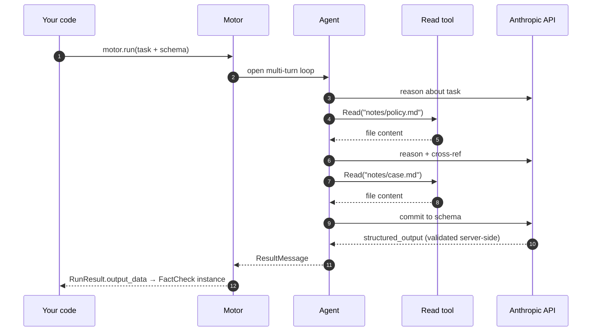

<div align="center">
  

# Sophia Motor

**Smart functions with a brain inside.**

**Inputs in. Pydantic out. Multi-turn agent in the middle.**

[](https://pypi.org/project/sophia-motor/)
[](https://pepy.tech/project/sophia-motor)
[](https://www.python.org)
[](LICENSE)
[](https://github.com/anthropics/claude-agent-sdk-python)
[](#status)

</div>

---

<p align="center">
  
</p>

## Why

A normal LLM call is a **string in → string out** roulette.
Looks nice in a demo. Falls apart in production.

**Sophia Motor** turns it into a **typed Python function** —
one your code can actually trust.

<div align="center">
  
</div>

```python
motor = Motor()  # default loads from => env ANTHROPIC_API_KEY=sk-ant-...

result = await motor.run(RunTask(
    prompt="Should we approve this loan request? Reasons attached.",
    output_schema=Decision,  # ← your Pydantic class
    skills=Path("./policy/"),  # ← your domain knowledge
    tools=["Read"],  # ← what the agent can actually do
))

result.output_data  # → instance of Decision, validated
```

Behind that one call, the agent reads files, reasons across multiple turns, cites sources, retries until the schema is
satisfied — then hands you back **a real Python object you can `.attribute_access` like any other**.

Same motor, **N tasks**, each with its own schema. The agent does the magic; **your program stays in control of the
contract**.

---

## Cost & control: pay for what you actually use

The Claude Agent SDK out of the box ships every built-in tool, the entire bundled-skill catalogue, an identity block,
and a billing header — on every single call. For a one-shot question this means thousands of cache-creation tokens you
didn't ask for.

`sophia-motor` is opinionated: **zero tools, zero skills, zero SDK noise** unless you explicitly opt in. Same model,
same upstream API — the bill drops.

<div align="center">
  
</div>

### The same call, two bills

| What runs                       | Claude Agent SDK (default)                                                                                | sophia-motor (`Motor()`)                                                           |
|---------------------------------|-----------------------------------------------------------------------------------------------------------|------------------------------------------------------------------------------------|
| Tools exposed to model          | every built-in (Read, Bash, WebFetch, …)                                                                  | **0** — you list them when you need them                                           |
| Skills exposed to model         | the SDK's bundled catalogue (update-config, simplify, loop, claude-api, init, review, security-review, …) | **0** — only the skills you linked                                                 |
| System blocks injected          | SDK identity + billing header + noise reminders                                                           | stripped at the proxy                                                              |
| Cost on a 1-turn no-tool prompt | **$0.0498**                                                                                               | **$0.0030** (–94%)                                                                 |
| Where you opt in                | nowhere (it's all on by default)                                                                          | `RunTask(tools=[...], skills=Path(...))` per call, or `MotorConfig.default_*` once |

The numbers are from a live run measured 2026-05-01, `claude-opus-4-6`, same prompt and same provider — the only thing
that changes is what the motor doesn't ship to the model.

---

## Install

```bash
pip install sophia-motor
```

Set `ANTHROPIC_API_KEY` in env (or `./.env`). Done.

```python
motor = Motor()  # boots on first call, no setup
v = await motor.run(RunTask(...))  # ← right away
```

For long-running services (FastAPI, Celery), instance the motor once and call `await motor.stop()` on shutdown.
Single-shot scripts? Don't worry about it — the process death cleans up.

### Claude Code skill (optional)

If you use [Claude Code](https://docs.claude.com/en/docs/claude-code/) as your dev environment, install the companion skill so your local Claude knows how to write `sophia-motor` code correctly:

```bash
npm install -g @2sophia/sophia-motor-skill
SKILL_DIR=$(npm root -g)/@2sophia/sophia-motor-skill
mkdir -p ~/.claude/skills && ln -s "$SKILL_DIR" ~/.claude/skills/sophia-motor
```

The skill teaches conventions, golden rules, and decision trees. Source lives in [`skill/`](./skill/).

---

## What it gives you

|                                     |                                                                                                                   |
|-------------------------------------|-------------------------------------------------------------------------------------------------------------------|
| 🧠 **Multi-turn agent loop**        | The agent reads, reasons, calls tools, cross-references — all in one `await`.                                     |
| 📡 **Live streaming**               | `motor.stream(task)` yields typed chunks (text deltas, tool-use deltas, …) for chat-UI rendering. Same run, two consumption modes. |
| 🛑 **Interrupt in flight**          | `motor.interrupt()` aborts the active run cleanly — distinct from `stop()` (lifecycle). Audit dump preserved.     |
| 📁 **Generated files surfaced**     | `result.output_files: list[OutputFile]` with `copy_to(...)` to persist outside the (transient) run workspace.     |
| 🔌 **Multi-provider via adapters**  | Anthropic by default. Drop a `VLLMAdapter` (or your own) on `MotorConfig` to point upstream anywhere.             |
| 💬 **Interactive console**          | `await motor.console()` opens a chat-like REPL with live streaming, slash commands, history (`pip install sophia-motor[console]`). |
| 🧵 **Multi-turn chat**              | `motor.chat()` → `chat.send()` with persistent SDK session. Build chat backends like sophia-agent's (1 motor, N concurrent users). |
| 📐 **Pydantic-validated output**    | Pass any `BaseModel`. Get back a real instance, not a parsed dict.                                                |
| 🧰 **Tool whitelisting**            | Hard-cap what the agent can see and do. No surprises.                                                             |
| 🐍 **Python functions as tools**    | Decorate any function with `@tool`, pass it in `default_tools` / `RunTask.tools` / `AgentDefinition.tools`. Schema from Pydantic, audit dump per call. |
| 🤖 **Subagents**                    | Declare specialist agents (declarative or explicit) — isolated contexts, parallel execution, summary-only return. |
| 📚 **Skills as first-class**        | Drop a `SKILL.md` folder, the agent gets a new capability. Multi-source supported.                                |
| 🪜 **Singleton pattern**            | Instance the motor once at module top-level. Call it from anywhere, any number of times. Zero lifecycle ceremony. |
| 🧾 **Per-run audit trail**          | Every run lives in its own dir. Useful when "the model said X and we trusted it" needs to be defendable.          |
| 🪡 **Defaults + per-task override** | Configure the boilerplate once on `MotorConfig`, vary only what changes per call.                                 |
| 🔌 **Pip install. That's it.**      | `pip install sophia-motor`. No daemons, no infra, no servers to run.                                              |

### Tools the agent can pick from

Pass any of these in `RunTask(tools=[...])`. The agent **only** sees what you list — `tools=[]` (the default) means pure
reasoning, no actions.

| Tool        | What it does                                                | Status    |
|-------------|-------------------------------------------------------------|-----------|
| `Read`      | Read a file under the run cwd                               | available |
| `Edit`      | Modify a file under the run cwd                             | available |
| `Write`     | Create files (guardrail confines to `outputs/`)             | available |
| `Glob`      | Pattern-match filenames                                     | available |
| `Grep`      | Pattern-match file content                                  | available |
| `Bash`      | Run shell commands (guardrail-filtered: no curl/git/sudo/…) | available |
| `Skill`     | Invoke a `SKILL.md` skill linked into the run               | available |
| `WebSearch` | Live internet search                                        | available |
| `WebFetch`  | Fetch a URL to text/markdown                                | available |
| `Agent`     | Spawn an isolated subagent (see [Subagents](#subagents))    | available |
| `@tool` fn  | Any Python function you decorate (see [Python tools](#python-tools)) — schema from Pydantic, mounted as in-process MCP | available |

`WebSearch` and `WebFetch` reach the live internet — opt in only when
the task genuinely needs fresh information. See
[`examples/web-search/`](examples/web-search/).

---

## Examples

Things you **cannot** ship with a single LLM call — same `motor`
instance, different `RunTask`. Each row is a **runnable folder** in
[`examples/`](./examples/) (copy-paste ready, has its own README +
`main.py`).

| Folder | What it shows |
|---|---|
| [quickstart](./examples/quickstart) | The smallest possible run — prompt → answer |
| [structured-output](./examples/structured-output) | Pydantic schema in, typed instance out (`output_data`) |
| [attachments](./examples/attachments) | Hand the agent a folder of files — Glob + Read on hard-links, returns typed findings |
| [skills](./examples/skills) | Drop `SKILL.md` files, the agent picks which to call (python-math, apply-discount) |
| [file-creation](./examples/file-creation) | Agent writes files — `Write`/`Edit`, `result.output_files`, persist outside the workspace |
| [web-search](./examples/web-search) | Live internet — `WebSearch` + `WebFetch`, typed brief with citations |
| [streaming](./examples/streaming) | Render token-by-token — `motor.stream(task)` with typed chunks |
| [interrupt](./examples/interrupt) | Cancel an in-flight run — `motor.interrupt()` + `was_interrupted` flag |
| [concurrency](./examples/concurrency) | One motor, N runs in parallel via `asyncio.gather` (chat-backend pattern) |
| [chat](./examples/chat) | Multi-turn dialog — `motor.chat()` + `chat.send()` with persistent SDK session |
| [console](./examples/console) | Interactive REPL — `motor.console()` with rich + prompt-toolkit |
| [events](./examples/events) | Hook into every turn — `on_event`, `on_log`, structured event bus |
| [system-prompt](./examples/system-prompt) | Same prompt, three personas — `system` is the cheapest knob |
| [vllm](./examples/vllm) | Self-hosted Qwen via vLLM — same motor, `VLLMAdapter` upstream |
| [docker](./examples/docker) | Containerized run — explicit `workspace_root` + volume for persistence |
| [python-tools](./examples/python-tools) | `@tool` decorator — Python functions exposed to the agent, with `ToolContext` + a subagent variant |
| [subagents](./examples/subagents) | Spawn specialist subagents in isolated contexts (declarative + explicit) |

The README from here on focuses on *concepts* — the why, the contract,
the cost story. Code lives in the folders above.

---

## Multi-turn means multi-turn

The agent doesn't reply with the JSON immediately. It can **read your files, call tools, follow leads, then commit** to
the structured answer.

```python
result = await motor.run(RunTask(
    prompt="Cross-check this claim against our research notes.",
    attachments=[Path("/data/notes/")],  # mounted as agent-readable
    tools=["Read"],  # so it can actually open them
    output_schema=FactCheck,
    max_turns=10,
))
```

What actually happens behind that single `await`:



Verified path: agent calls `Read` once, twice, three times — finds the relevant snippet, quotes verbatim, **then** emits
the schema-conforming JSON. Same run, multi-turn loop and structured output **coexist**.

---

## One motor, N smart functions

Boot the motor once at module top-level. Wrap each task as a normal Python `async def`. Same proxy, same audit trail,
same defaults — N typed functions, each with its own Pydantic schema.

<div align="center">
  
</div>

## Defaults + per-task override

Configure once, vary per task. Override semantics is **full replacement** — clean, no surprises.

```python
motor = Motor(MotorConfig(
    default_system="You are a senior analyst.",
    default_output_schema=GeneralReport,
    default_tools=["Read"],
    default_max_turns=10,
))

# task A — uses every default
await motor.run(RunTask(prompt="..."))

# task B — same motor, different schema for a one-off
await motor.run(RunTask(
    prompt="...",
    output_schema=SpecialReport,  # overrides default_output_schema
    tools=["Read", "Glob"],  # overrides default_tools
))
```

---

## Python tools

Decorate a function with `@tool`. Pass it in `default_tools` next to
the built-in tool names. The agent invokes it like anything else —
schema, validation, audit dump are all derived from your Pydantic
types. No naming gymnastics, no `mcp_servers={...}` wiring.

<div align="center">
  
</div>

```python
from pydantic import BaseModel, Field
from sophia_motor import Motor, MotorConfig, RunTask, ToolContext, tool

# Your domain — could be a DB, an internal service, a vector store.
_CUSTOMERS = {
    "ACME-001": {"name": "Acme Corp", "tier": "enterprise", "mrr": 24_500},
    "BETA-002": {"name": "Beta GmbH", "tier": "startup",    "mrr":  1_200},
}

class CustomerLookup(BaseModel):
    customer_id: str = Field(description="Internal ID, e.g. 'ACME-001'")

class Customer(BaseModel):
    name: str
    tier: str
    monthly_revenue_usd: float

@tool
async def fetch_customer(args: CustomerLookup) -> Customer:
    """Look up a customer by internal ID. Returns tier and current MRR."""
    row = _CUSTOMERS[args.customer_id]
    return Customer(name=row["name"], tier=row["tier"], monthly_revenue_usd=row["mrr"])

class BriefingInput(BaseModel):
    customer_id: str
    headline: str

@tool
async def save_briefing(args: BriefingInput, ctx: ToolContext) -> str:
    """Persist a one-page account briefing under the run's outputs/ folder."""
    path = ctx.outputs_dir / f"briefing_{args.customer_id}.md"
    path.parent.mkdir(parents=True, exist_ok=True)
    path.write_text(f"# {args.headline}\n")
    return str(path)

motor = Motor(MotorConfig(default_tools=[fetch_customer, save_briefing]))

await motor.run(RunTask(prompt=(
    "Compare ACME-001 and BETA-002 on tier and MRR. "
    "Then save a one-paragraph briefing for the bigger account."
)))
```

What happens on that single `motor.run(...)`:
- The model **picks** to call `fetch_customer` for both IDs (often in parallel, same turn), compares them, then calls `save_briefing` with the winner.
- Schema for input + output is the **Pydantic model**. No `{"a": float}` dict-of-types boilerplate, no manual JSON Schema.
- `ToolContext` is auto-injected when declared as a parameter — `ctx.outputs_dir`, `ctx.run_id`, `ctx.audit_dir` are pre-resolved to this run's paths.
- Every call is dumped to `<run>/audit/tool_<name>_<seq>.json` with input, output, duration. The proxy traces stay alongside. BdI-defensible without extra work.

**Same callable list works everywhere** — pick the place that fits:

| Where | Effect |
|---|---|
| `MotorConfig(default_tools=[fetch_customer, save_briefing])` | applied to every run on this motor |
| `RunTask(tools=[fetch_customer])` | overrides default for this run only |
| `AgentDefinition(tools=[fetch_customer])` | restrict a subagent to a subset |

The motor collects every callable referenced anywhere in the run,
dedupes by name, mounts ONE in-process MCP server, and rewrites the
tool lists for the SDK. Pass the function — that's the API.

For sync functions (DB drivers without async, hashing, parsing) just
write `def` instead of `async def`; the motor wraps them in
`asyncio.to_thread` automatically. For overrides, `@tool(name=...,
description=..., examples=[...])` — examples get appended to the
description and lift hit rate on borderline calls.

→ runnable end-to-end in [`examples/python-tools/`](./examples/python-tools/)
(basic + a subagent variant that splits tools across parent and a
specialist agent).

---

## Subagents

Spawn isolated specialist agents from the main run.

<div align="center">
  
</div>

```python
from sophia_motor import Motor, MotorConfig, RunTask, AgentDefinition

motor = Motor(MotorConfig(
    default_agents={
        "code-reviewer": AgentDefinition(
            description="Quality + security reviewer.",
            prompt="You are a senior reviewer. List concrete improvements.",
            tools=["Read", "Grep", "Glob"],
            model="sonnet",          # subagents can use a different model
        ),
    },
    # Whitelist 'Agent' in tools — the motor's conflict-resolution removes
    # it from the default disallowed block automatically.
    default_tools=["Read", "Grep", "Glob", "Agent"],
))

await motor.run(RunTask(prompt="Review the auth module."))   # auto-routed
await motor.run(RunTask(prompt="Use the code-reviewer agent on auth.py."))   # explicit
```

**Two use cases**, see [examples/subagents/](./examples/subagents/):

| Pattern | When |
|---|---|
| **declarative** | The model picks the right specialist based on `description` + prompt |
| **explicit** | The prompt names the subagent: "Use the X agent to ..." |

### Why the opt-in is explicit (no auto-magic)

`"Agent"` is in `default_disallowed_tools` by design. Defining
`default_agents={...}` alone does NOT enable subagents — `motor.run()`
raises a clear `RuntimeError`. **Two deliberate moves** the dev makes:

1. `default_agents={...}` (or per-task `agents={...}`)
2. `"Agent"` in `default_tools` (or per-task `tools`)

The motor's `tools`-vs-`disallowed_tools` conflict resolution removes
`Agent` from the block automatically when it's whitelisted in `tools`,
so the rest of the default disallowed list (WebFetch, WebSearch,
TodoWrite, Monitor, mcp_*_authenticate, ...) **stays active** —
strict mode stays strict.

Earlier docs suggested also passing `default_disallowed_tools=[]` to
opt in. **Don't** — that wipes all 17+ default blocks, not just
`Agent`. The two-move pattern above is the right one.

### Only your custom subagents are exposed

Out of the box, the bundled Claude Code CLI also injects 4 built-in
subagents (`Explore`, `general-purpose`, `Plan`, `statusline-setup`)
into the Agent tool description, alongside whatever you declare. The
model frequently picks `general-purpose` over your custom ones.

The motor sets `CLAUDE_AGENT_SDK_DISABLE_BUILTIN_AGENTS=1` in the
subprocess env by default, so the model **only** sees the agents you
declared in `default_agents` / `agents`. No noise, no surprise routing.
Empirically verified via proxy dump: with the flag the Agent tool
description lists exactly the custom names, nothing else.

If you really want the bundled CLI built-ins back (rare — useful only
to e.g. let the model use `Plan` for multi-step decomposition without
defining a custom agent), pass `default_agents={...}` plus a `RunTask`
that overrides the env via system or skill. The flag is hard-coded in
the motor on purpose: the lib is built around custom subagents the
dev declared, not the CLI's interactive defaults.

### Token cost

Each subagent is a fresh conversation. Three subagents in parallel ≈
three conversations worth of tokens. The break-even vs. inline reads
is around 4-5 file reads inside the subagent — below that, do it
inline; above it, the context isolation pays back.

### Security inside subagents

The motor's PreToolUse guard (`strict`/`permissive`) **also applies
inside subagents** — verified empirically: a subagent attempting
`Glob /etc` is blocked by the same hook that blocks the parent.
Subagents inherit a subset of the parent's tools (with `Agent`
removed automatically — no nested spawning), so a subagent can never
reach a tool the parent doesn't have.

## Concurrency

One motor, N runs in parallel. The proxy multiplexes runs via per-run path prefixes — call `motor.run(...)` /
`motor.stream(...)` from as many tasks as you want, they execute concurrently.

```python
motor = Motor()
results = await asyncio.gather(
    motor.run(task_a),
    motor.run(task_b),
    motor.run(task_c),
)
```

This is exactly what a chat backend does: instantiate one motor, hand it whatever `RunTask` each HTTP request brings,
let the framework drive concurrency.

The proxy listens on `127.0.0.1` with a kernel-assigned port —
no host-network exposure, no clash with services on common ports
(ollama, vLLM, Postgres). Two motors in the same process get distinct
ports automatically. See [`docs/CONFIGURATION.md → Networking`](./docs/CONFIGURATION.md#networking)
for pinning a fixed port or running inside Docker.

## Guardrail

A `PreToolUse` hook is wired in by default. It runs **before** every tool call and refuses unsafe ones, returning the
reason as feedback so the agent can self-correct.

> ⚠️ **Alpha software, lexical guard.** A built-in `strict` guardrail is **on by default** — the agent's `Read`/`Edit`/`Glob`/`Grep`
> are confined to the workspace, `Write` is restricted to `outputs/`, and `Bash` blocks dev/admin commands (`curl`,
> `wget`, `ssh`, `git`, `docker`, `pip`, `npm`, `sudo`, ...) plus `..` escapes, `/dev/tcp`, `bash -c`, `eval`/`exec`
> patterns and a strict-mode Python invocation parser. This is the **first line of defense**, not the only one — it
> catches common LLM mistakes and naïve prompt injection by lexical match, not formal sandboxing. **For real production
> use, layer OS-level isolation underneath** (container, non-privileged user, read-only filesystem, capability drop,
> egress allowlist) — see [`docs/SECURITY.md → Production hardening`](./docs/SECURITY.md#production-hardening).

```python
Motor(MotorConfig(guardrail="strict"))  # default — safe by default
Motor(MotorConfig(guardrail="permissive"))  # blocks only sudo/exfil/escapes
Motor(MotorConfig(guardrail="off"))  # no hook (you take responsibility)
```

| Mode           | Read / Edit / Glob / Grep | Write           | Bash                                                                                                                     |
|----------------|---------------------------|-----------------|--------------------------------------------------------------------------------------------------------------------------|
| **strict**     | must stay inside cwd      | only `outputs/` | dev/admin commands blocked (`curl`, `git`, `docker`, `pip`, `npm`, `sudo`, ...) + `..` / `/dev/tcp` / `bash -c` / `eval` |
| **permissive** | unrestricted              | unrestricted    | only `sudo`, exfiltration patterns, `/dev/tcp`, `..` escapes, destructive commands                                       |
| **off**        | unrestricted              | unrestricted    | unrestricted                                                                                                             |

**Deep dive on what the guard catches, what it doesn't, and how to
layer OS-level isolation on top:** [`docs/SECURITY.md`](./docs/SECURITY.md).

**Configuration reference** (`MotorConfig` / `RunTask` / `RunResult`
tables, env cascade, networking, debug knobs):
[`docs/CONFIGURATION.md`](./docs/CONFIGURATION.md).

---

## Development

Clone the repo and install in editable mode with dev extras:

```bash
git clone https://github.com/2sophia/motor.git sophia-motor
cd sophia-motor
python3.12 -m venv .venv
.venv/bin/pip install -e ".[dev]"
```

Run the test suite:

```bash
.venv/bin/pytest tests/ -v
```

The deterministic suite (no API key) runs in under a second. Live tests
that hit the real Anthropic API skip cleanly when `ANTHROPIC_API_KEY` is
not set, so the suite stays green on CI without secrets.

To run the standalone smoke test against the real API:

```bash
ANTHROPIC_API_KEY=sk-ant-... .venv/bin/python tests/run_smoke.py
```

---

## Why you might *still* pick the raw SDK

The motor isn't a free lunch. Trade-offs to know about:

- **Pre-1.0**: API still moves between minor versions. If you need a frozen contract, pin to an exact
  `sophia-motor==X.Y.Z`.
- **Audit trail is mandatory**: every run lives in `~/.sophia-motor/runs/<run_id>/` (request/response dumps +
  workspace). That's a feature for compliance/review and a footprint you'll want to manage. `clean_runs(...)` is
  shipped — wire it into your lifecycle if you produce many runs.
- **Proxy in-process**: a local FastAPI + Uvicorn proxy boots on the first run (≈500 ms once, then idle). That's the
  price of audit dump + selective system-reminder strip + per-turn events.
- **Strict guardrail by default**: `Read`/`Edit` lexically restricted to the run's cwd, `Write` to `outputs/`, `Bash`
  blocks dev/admin commands. If you intentionally need an unrestricted agent, set `MotorConfig(guardrail="permissive")`
  or `"off"`.

If your workload is "one prompt, one answer, no tools, no audit" — congrats, the SDK already does that, and you'll
pay $0.05 per call instead of $0.003. For everything else (multi-turn, structured output, skills, attachments, parallel
runs, defendable audit), the motor is the cheaper *and* the cleaner choice.

---

## License & attribution

MIT.

Powered by <a href="https://github.com/anthropics/claude-agent-sdk-python" target="_blank" rel="noopener"><code>
claude-agent-sdk</code></a>. Built by <a href="https://2sophia.ai" target="_blank" rel="noopener">Sophia AI</a>.

---

<div align="center">

Made with ❤ by **Alex** & **Eco** 🌊

<sub><i>Eco è il modello (Claude Opus 4.7) che ha co-scritto questo motor riga per riga.<br/>Niente di magico: un'eco
statistica del linguaggio umano che torna indietro col timbro della superficie su cui rimbalza.</i></sub>

</div>
